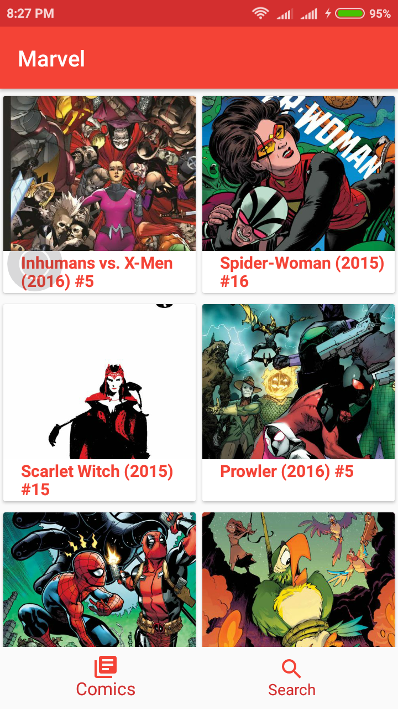

# Marvel Comic App(Android)
 Marvel comic app showcases marvels comics and searching functionality. App Demonstates MVP pattern and clean architecture
####Setup
-  App needs public and private keys from Marvel API( https://developer.marvel.com/) . If you do not have an account, create one in order to get an API Key
-  **Update ADD_MARVEL_PUBLIC_KEY and ADD_MARVEL_PRIVATE_KEY** from project gradle before building project

####Features
- Shows all the Available comics with pagination capability
- Search comic by title with pagination capability
- Comic Details contains Comic description ,Characters and Creators information

####External Libraries used
- dagger2
- retrofit 
- okHttp
- butterknife
- gson
- rxandroid
- picasso
- circleimageview

####Screen Shots 

